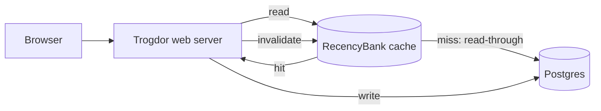

# Worked Example — RecencyBank Design Doc

A complete, **right-sized**, **stand-alone** design doc built from the article's example fragments. It is the imitation target: notice what it specifies (the irreversible, high-penalty decisions and the public contract) and what it deliberately leaves to implementation (eviction tuning, exact key encoding, log field names). It reads top-to-bottom so a cold reader is oriented before reaching the design.

> The annotations in **‹angle brackets›** are commentary on *why* each part is written this way. They are not part of the doc.

---

# RecencyBank

**‹Title — short, distinctive, evocative: a "bank" of recently-used rows.›**

| | |
|---|---|
| **Author** | Dana Okafor — dana@example.com |
| **Created** | 2026-03-02 |
| **Canonical URL** | http://go/recency-bank |
| **Status** | In review |

**‹Metadata — attributable and locatable; the shortlink is the address people will paste.›**

## Objective

Improve application performance by adding a caching layer between the Trogdor web server and the Postgres database.

**‹One sentence, plain language. A non-engineer PM understands it. No architecture leaks in.›**

## Background

When we launched the Trogdor web app in 2023, pages typically loaded in 100ms or less. After three years, median page loads have ballooned to 600ms, and user complaints about sluggishness are now our top support category.

The cause is database load, not application code. Profiling the last 30 days shows that **95% of database lookups are for the same 3% of database rows** — a small set of "hot" records (popular dashboards, the current user's profile, reference tables) re-fetched on nearly every request. Postgres serves each lookup correctly but pays full query cost every time.

A read-through cache in front of Postgres, holding the hot rows in memory, would absorb the vast majority of these lookups and return Trogdor's latency toward its 2023 baseline. No prior caching attempt exists; pages query Postgres directly today.

**‹Background does the heavy lifting. It's quantified (100ms → 600ms, 95%/3%), it names the real cause, and it makes the proposed solution feel inevitable. A partner-team reader who'd never heard of this project now understands what and why — the page-one stand-alone test passes here.›**

## Goals

- Return Trogdor's median user-facing page latency to ≤ 200ms.
- Reduce Postgres read query volume by at least 80% at peak.
- Keep cached data consistent with Postgres within 5 seconds of a write.

**‹Outcomes, not implementations. None of these says "use Redis" — that's a Dependencies decision, not a goal.›**

## Non-Goals

- Create a general-purpose, reusable caching system. Re-using this cache on other systems is out of scope; RecencyBank is shaped for Trogdor's access patterns only.
- Cache write paths. Only reads are cached; writes go straight to Postgres.
- Replace Postgres or change the Trogdor data model.

**‹Non-goals kill the three assumptions a reviewer would otherwise make: "is this a platform?", "does it cache writes?", "is this a database migration?".›**

## Constraints

- Must run within the existing single-region GCP project; no new region or vendor approval is in scope this quarter.
- Memory budget: one cache node, ≤ 16 GB — the hot set measured at ~2 GB, leaving headroom.
- Cannot change Trogdor's public HTTP API; this is an internal-only change.

## Scenarios

**Cache hit (the common case).** Priya loads her KeyMetrics dashboard. Trogdor requests the dashboard's rows through the data-access layer. RecencyBank holds them (they're in the hot 3%), returns them from memory in under 5ms, and the page renders without touching Postgres.

**Cache miss then fill.** A new analyst, Sam, loads a rarely-viewed legacy report. RecencyBank has no entry, so it reads through to Postgres, returns the rows to Trogdor, and stores them. Sam's second visit is a hit.

**Write invalidation.** Priya edits a dashboard title. Trogdor writes the change to Postgres and signals RecencyBank to invalidate that row. The next read misses, re-fills from Postgres, and every viewer sees the new title within the 5-second consistency goal.

**‹Named actors, concrete steps, observable end states. A reviewer reading these immediately checks them against the requirements — and would catch, e.g., "what about a write made directly to Postgres by a batch job?" — which is exactly what scenarios are for.›**

## Diagram



*Source: `http://go/recency-bank-diagram` (editable).* **‹Diagram-as-code, source-linked, reproducible — never a whiteboard photo.›**

## Interfaces

Trogdor currently constructs its server with a concrete Postgres handle:

```go
type Server struct {
    db PostgresDB
}
```

We introduce a `Store` interface so the cache can sit transparently in the read path via dependency injection:

```go
type Store interface {
    GetUser(id UserID) (User, error)
    ListUsers() ([]User, error)
    // …remaining read methods Trogdor already calls
}

type Server struct {
    db store.Store // production: RecencyBank wrapping Postgres; tests: a fake
}
```

RecencyBank implements `Store`: on each read it checks its in-memory map and, on a miss, delegates to the underlying Postgres-backed `Store` and caches the result. Writes are **not** part of `Store`'s cached path; they continue to the Postgres store directly, followed by an `Invalidate(key)` call.

**‹Specifies the seam — the contract everything else depends on — without writing the eviction algorithm or the key-encoding scheme. Those are reversible implementation details, so they're left to code.›**

## Dependencies & Infrastructure

- **Language:** Go — same as Trogdor, so RecencyBank links in-process and shares the build/deploy pipeline. **‹High penalty to change later; called out deliberately.›**
- **Cache store:** in-process Go map behind the `Store` interface for v1. Because access is behind the interface, swapping to an out-of-process store (e.g. Redis) later is a contained change — **‹low penalty, so we don't agonize over it now.›**
- **Persistent data:** unchanged — Postgres remains the system of record. RecencyBank holds no durable state.
- **Runtime:** the existing Trogdor GKE deployment; no new infrastructure.

## SLOs

- Trogdor's 50th percentile latency for user-facing HTTP requests: **≤ 200ms**.
- Trogdor's 95th percentile latency for user-facing HTTP requests: **≤ 800ms**.
- Cache freshness: a write is reflected in reads within **5 seconds**.

**‹Every promise is a number with a percentile and a unit — confirmable by a metric. No "fast" or "performant."›**

## Monitoring & Alerting

- Export cache hit-rate, read-through latency, and entry count to the existing metrics pipeline.
- **Alert** when Trogdor's 95th percentile user-facing latency **≥ 3s** for 5 minutes.
- **Alert** when cache hit-rate drops below 70% for 15 minutes (signals the hot-set assumption breaking).
- **Page** if the cache node's memory exceeds 14 GB (approaching the 16 GB cap).

## Logging

- Log cache misses at `INFO` with the requested entity type and latency; log read-through errors at `ERROR`.
- Retain logs 30 days in the existing centralized store; same access controls as Trogdor.
- **Keep row *contents* out of logs** — log the cache key's entity type and id, never the cached PII fields.

## Timeline

| Milestone | Deliverable | Target |
|---|---|---|
| M1 | `Store` interface extracted; Trogdor runs unchanged behind it (no cache yet) | Week 2 |
| M2 | RecencyBank serving reads in staging on **synthetic hot-set data**, behind a flag | Week 4 |
| M3 | Production rollout to 10% of traffic with monitoring | Week 6 |
| M4 | Full rollout; SLOs sustained for 1 week | Week 8 |

**‹M2 ships against synthetic data first — if the hot-set assumption is wrong, we find out in week 4, not week 8.›**

## Security & Privacy

- **Attack surface / trust boundary:** RecencyBank is in-process and never exposed to the network; its only callers are Trogdor's own read paths inside the existing trust boundary. No new external surface is introduced.
- **Sensitive data:** cached rows can include user PII (names, emails). It lives only in memory, is never persisted by RecencyBank, and is evicted on restart. Access is identical to Trogdor's existing DB access — no new principals gain reach.
- **Threats considered:** stale-after-delete (a deleted user's row served from cache) is mitigated by write-invalidation; memory exhaustion is bounded by the 16 GB cap and eviction.

**‹Even though the surface is small, the rationale is written down — which is exactly what invites a reviewer to spot the threat we missed.›**

## Open Issues

1. **Cross-instance invalidation.** Trogdor runs multiple replicas; an in-process cache per replica means a write on replica A doesn't invalidate replica B. *Options:* (a) accept up to 5s staleness via short TTL; (b) add a pub/sub invalidation channel. *Next step:* measure real replica count and write rate, then ask the tech lead to weigh in.
2. **Hot-set drift.** The 3% hot set was measured once; it may shift seasonally. *Options:* periodic re-measurement, or adaptive eviction. *Next step:* add the hit-rate alert (above) as an early-warning signal and revisit after M3.

**‹Each issue states the problem, the options, and a concrete, assignable next step — not "TBD".›**

## Alternatives Considered

- **Add read replicas to Postgres.** Scales reads but doesn't cut per-query latency for the hot set, and adds replication lag and cost. Doesn't meet the 200ms goal.
- **Application-level Redis from day one.** Solves cross-instance invalidation natively, but adds an out-of-process dependency and network hop before we've proven the hot-set assumption. The `Store` interface keeps this as a cheap future upgrade if v1's in-process map proves insufficient.
- **Query optimization / better indexes.** Already largely done; the remaining cost is round-trip and fixed query overhead, which caching removes and indexing can't.

**‹A few honest lines each: the strong alternative, and the specific reason it lost. Enough for a reviewer to see we considered the obvious options.›**

---

## What to Take From This Example

- **The front matter alone passes the stand-alone test** — Objective + Background tell a cold reader what and why.
- **Goals are outcomes; non-goals fence the scope; SLOs are measurable.**
- **The Interfaces section specifies the seam, not the implementation** — the eviction policy and key encoding are intentionally absent because they're cheap to change.
- **High-penalty choices (language, system-of-record) are explicit; low-penalty ones (map vs Redis) are named as deferrable.**
- **Open issues are honest and assignable; alternatives are brief.**

Imitate the *shape* and the *restraint*, not the specific domain.
